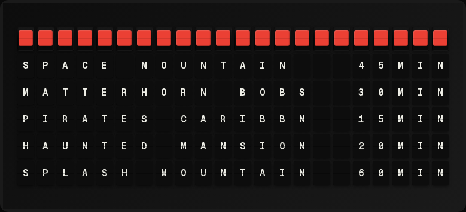

# Disney Park Queue Times Plugin

Display wait times for Disney parks and rides (Disneyland, California Adventure, Disney World, Epcot, etc.) from [Queue-Times.com](https://queue-times.com/).

**→ [Setup Guide](./docs/SETUP.md)** – Configure parks and rides in Integrations

<!-- Add a screenshot of the plugin display once you have one -->


## Overview

The plugin fetches live wait times from the free Queue-Times.com API. You select one or more Disney parks and which rides to show. Data is updated every 5 minutes by the API. No API key required; attribution to Queue-Times.com is shown on the default display.

## Features

- Multiple Disney parks (Disneyland, California Adventure, Magic Kingdom, Epcot, Hollywood Studios, Animal Kingdom, and other Disney resorts)
- Multiple rides per park; pick only the ones you care about
- User-friendly park and ride names in settings (no raw IDs)
- Optional template variables for custom pages
- Default 6-line display with attribution

## Data Source

- [Queue-Times.com API](https://queue-times.com/pages/api) – free, no key required
- Display must include “Powered by Queue-Times.com” (plugin does this on the default view)

## Template Variables

### Simple

- `{{disney_parks_times.formatted}}` – Short summary line

### Parks array

- `{{disney_parks_times.parks.0.park_name}}` – First park name
- `{{disney_parks_times.parks.0.rides.0.ride_name}}` – Full ride name
- `{{disney_parks_times.parks.0.rides.0.ride_abbr}}` – Abbreviated ride name (up to 14 chars, word-boundary aware)
- `{{disney_parks_times.parks.0.rides.0.tiny_abbr}}` – Very short name (max 5 chars, no spaces) for compact display
- `{{disney_parks_times.parks.0.rides.0.wait_time}}` – Wait time in minutes
- `{{disney_parks_times.parks.0.rides.0.is_open}}` – true/false
- `{{disney_parks_times.parks.0.rides.0.status}}` – "Open" or "Closed"
- `{{disney_parks_times.parks.0.rides.0.state_color}}` – Color tile: green when open, red when closed
- `{{disney_parks_times.parks.0.rides.0.formatted}}` – One string: state color + tiny_abbr + wait (e.g. `{66}RISE  45m` or `{63}RISE  --`). Fixed width for column alignment.

Use index `.1`, `.2`, etc. for more parks and rides.

## Example Template

Using full names or abbreviations (ride_abbr fits better on 22-char lines):

```
{{disney_parks_times.parks.0.park_name}}
{{disney_parks_times.parks.0.rides.0.ride_abbr}}: {{disney_parks_times.parks.0.rides.0.wait_time}}m
{{disney_parks_times.parks.0.rides.1.ride_abbr}}: {{disney_parks_times.parks.0.rides.1.wait_time}}m
```

## Implementation Notes

- Park names are resolved from Queue-Times `parks.json` (Walt Disney Attractions group only); cached 5–10 minutes.
- Per-park queue data is fetched from `parks/{id}/queue_times.json` and filtered by configured ride IDs.
- Plugin caches result for the configured refresh interval (default 300 seconds).
